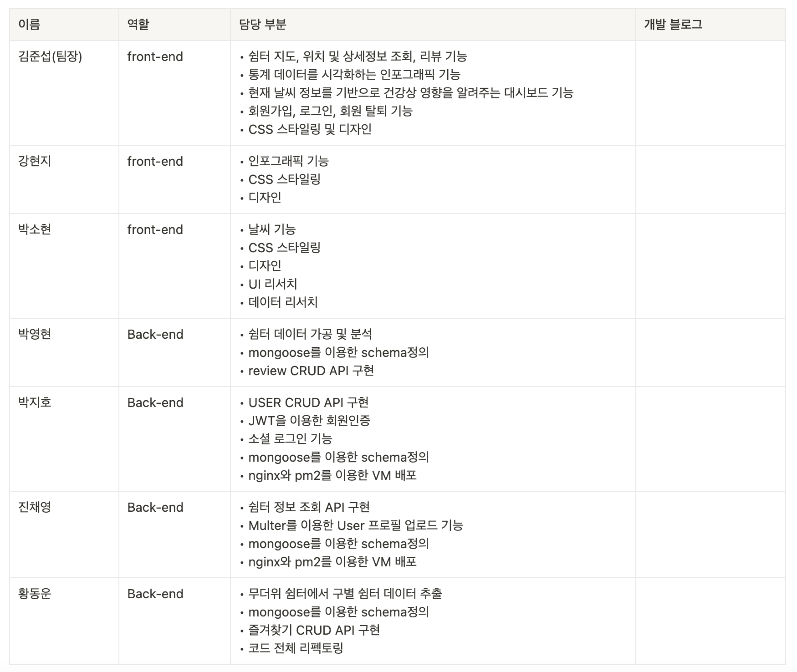

# 무한쉼터🏘️ : 내 지역 쉼터찾기 서비스

> 나날이 오르는 전기세, 난방비 어떻게 절약할 수 있을까요?
> 누구든지 **무한쉼터**를 통해 우리집 주변 무더위, 한파 쉼터를 찾아보세요~

## 어떤 서비스인가요?

- 서울 지역 중심으로 무더위+한파 쉼터를 GPS를 이용해 조회할 수 있는 서비스
- 무더위와 한파가 극한으로 감에 따라 대피할 수 있는 지역별 쉼터의 필요성이 높아졌지만 정작 우리 주변의 쉼터의 위치는 우리가 직접 찾아보기 어려움으로 인해 기획한 본격 쉼터 찾기 서비스
- 극한기후를 대피할 수 있는 쉼터 위치정보 및 각종 관련 통계정보들을 시민들에게 전달해주는 서비스

## Contents

Click to scroll to that page

1. How to start? : 시작 가이드
2. Project Info : 프로젝트 소개

- ​Project intention : 프로젝트 기획 의도
- Service & Data Analysis : 서비스 및 데이터분석
- How can use this project?

3. Stacks : 사용 기술 스택
4. WEB MVP & Project tree : 주요 기능 및 프로젝트 구조

- Page Image 페이지 구성
- 기능 소개
- ERD

5. Trouble Shooting : 트러블 슈팅
6. END with Members: 프로젝트 멤버 및 역할 소개

## 1. How to start : 시작 가이드

For building and running the application you need :

- [Node.js 18.17.1](https://nodejs.org/en)
- [npm 9.6.7](https://www.npmjs.com/)
- [yarn 1.22.19](https://yarnpkg.com/)

Installation

```bash
git clone https://kdt-gitlab.elice.io/ai_track/class_08/data_project/team03/data-analysis-project.git
cd data-analysis-project
```

Front

```
cd front
npm install
npm run start
```

Back

```
cd back
yarn
## 서버만 실행할 경우
yarn start
## 개발 모드로 실행할 경우
yarn dev
```

## 💻 2. Project Info : 프로젝트 소개

### ✔️개발 기간

- 2023.08.14 ~ 2023.09.01 (3주)

### ✔️ 배포 서버

- 34.64.160.14

### ✔️ 프로젝트 기획 의도

서비스 소개

- 서울시 열린데이터 광장 홈페이지의 데이터를 이용한 쉼터 조회서비스입니다.
- 내 위치 중심으로 주변 쉼터를 조회할 수 있습니다.
- 무더위/한파 속 우리동네 쉼터를 찾아보세요!

기능 소개

- 위치조회
- 구별 쉼터 정보 조회
- 쉼터 상세정보 조회
- 현재 날씨 조회
- 통계 데이터 기반 그래프와 같은 시각화 자료 제공
- 쉼터별 리뷰 작성 기능
- 리뷰 작성 횟수별 등급 타이틀 부여
- 쉼터 즐겨찾기 기능

### ✔️ 서비스 및 데이터분석

#### 서비스 설명

1. 기획 의도

- 기후변화는 이제 먼 미래의 일이 아니라 일상이 되어버렸습니다. 폭염과 한파같은 극단적인 기상 상황이 발생하는 빈도와 주기가 점점 증가하고 있습니다. 이러한 상황에서 시민분들이 건강을 지키고 안전하게 휴식하실 수 있도록, 정부와 지자체에서는 ‘무더위 쉼터’와 ‘한파 쉼터’를 지정, 운영, 관리하고 있습니다. 그래서 시민분들이 내 동네와 현재 위치 인근의 ‘극한날씨 쉼터’의 위치와 상세정보를 지도상에서 손쉽게 파악해서 이용할 수 있도록 해주고, 기후변화라는 현실을 개인 및 가구 차원에서도 대처할 수 있도록 각종 관련 데이터들을 시각화해서 직관적으로 정보전달을 해주는 서비스를 기획하게 되었습니다.
  - 정부 및 지자체에서 제공하는 극한날씨 쉼터에 대한 접근성을 높여 시민들의 건강관리에 도움을 줍니다.
  - 냉난방 기구가 마련되어있는 공공장소인 극한날씨 쉼터의 이용을 장려합니다. 개별가구의 냉난방기구 사용량을 낮춰 전력소비량 경감에 기여합니다.
  - 극한날씨의 위험성에 관련된 시각화된 데이터를 보여줘서 시민들이 미리 대비하고 건강관리를 할 수 있도록 도와줍니다. 그리고 기후변화에 대한 시민들의 인식을 향상시킵니다.
  - 극한날씨 쉼터의 접근성과 현황에 관련된 데이터도 함께 보여줘서 지방자치 개선과 시민참여에도 활용할 수 있도록 해줍니다.

2. 웹 서비스의 최종적인 메인 기능과 서브 기능 설명
   1. 극한날씨 쉼터 지도 기능
      - 정부 및 지자체에서 지정하고 관리하는 극한날씨 쉼터의 위치를 지도에 마커로 표시해 줍니다.
      - 사용자가 선택한 세부 행정구역에 있는 쉼터들의 목록을 표시해줍니다.
      - 장소명, 주소, 담당기관, 연락처, 냉난방기구 현황 등 각 쉼터의 상세 정보를 표시해줍니다.
      - 쉼터를 방문 및 이용한 사용자들이 남긴 후기를 표시해줍니다.
   2. 기상정보 대시보드 기능
      - 사용자가 선택한 지역에 현재 발령된 기상 정보를 표시합니다.
      - 온도, 습도, 풍속 등 현재의 기상상황 뿐만 아니라 단기 기상 예보도 제공합니다.
   3. 인포그래픽 대시보드 기능
      - 다음과 같은 각종 통계 데이터를 그래프로 시각화해서 보여줍니다.
        - 극한날씨 쉼터와 관련된 데이터
          - 예) 서울시에 있는 각 구마다 보유한 쉼터 개수
        - 극한날씨에 따른 건강관리 관련 데이터
          - 예) 폭염시 온열질환 환자수 추이
        - 에너지 사용량 등 친환경 관련 데이터
          - 예) 월별 정전사고 발생 빈도
   4. 마이페이지 기능
      - 사용자가 계정을 만들고 계정 정보를 변경할 수 있습니다.
      - 사용자가 쉼터 후기를 작성하고, 작성한 목록을 열람할 수 있습니다.
3. 프로젝트 구성
   - 와이어프레임
   - https://www.figma.com/file/XN9emec1bDRj67ZIkSd5k4/data_web_service
   - 스토리보드
   - https://www.figma.com/file/XN9emec1bDRj67ZIkSd5k4/data_web_service
4. 유저 시나리오

- Who
  - 출장과 야외 활동이 많고 건강에도 관심이 많은 38세 강형욱님
- What
  - 주요 활동 지역에 있는 쉼터의 위치를 쉽게 파악하고 방문하고자 함
- When
  - 폭염과 한파와 같은 극단적인 날씨로부터 안전한 휴식이 필요한 언제나
- Where
  - 극단적인 날씨로부터 직접적인 영향을 받는 야외 활동 및 이동중에
- Why
  - 우리 동네 극한날씨 쉼터가 어디에 얼마나 있는지 알아보기 위해
  - 접근성이 좋은 극한날씨 쉼터를 방문해 건강을 지키고 휴식을 가지기 위해
  - 극단적인 기후가 왜 발생하는지 기후변화 관련 정보를 알아보기 위해
  - 극단적인 기후가 발생할 가능성이 높은 시기를 알고 미리 대비하기 위해

#### 데이터 분석

- [서울 열린데이터광장]()에서 서울시 쉼터(무더위, 한파)와 인구밀도(인구/면적)에 대한 데이터 확보
- 무더위 쉼터와 한파 쉼터를 하나의 데이터 테이블로 통합(한파 쉼터의 위치 정보를 XY좌표계 값ㅇ르 경위도 좌표계 값으로 변환)
- 서울시 구별로 인구/면적 대비 쉼터의 수용인원/면적 분석
- 무더위 쉼터와 한파 쉼터의 위치 정보 데이터의 형식이 경위도 좌표계와 XY좌표계로 형식이 다름
- 하나의 데이터 테이블로 합치기 위해 한파 쉼터의 XY좌표계 값을 경위도 좌표계 값으로 변환 필요
- 한파 쉼터의 GRS-80 XY좌표계 값을 경위도 좌표계 값으로 변환하는 수식은 찾기 어려워서 주소 값을 위경도 값으로 변환해주는 Geocode라는 구글 스프레드시트의 확장 기능을 활용

### ✔️ 프로젝트 구조

#### 🧩 front-end


> 페이지별 구조

- Poi 페이지 기반으로 구현된 서비스.

* Poi란? 위치 정보를 가진 관심 지점을 뜻하는 용어로, 디지털 지도 위에서 표현될 수 있는 주요 시설물(관광지, 교통시설, 문화 시설, 음식점, 연례 축제 장소 등)과 지역 등을 지칭.
* Main Poi(Point of interest) : 본인 위치 조회, 구별 지역 쉼터 페이지.
* Weather : 위치 기반으로 날씨데이터를 API로 가져와 날씨, 기온, 습도 등을 아이콘으로 시각화한 페이지
* Infographic : 지역별 쉼터의 필요성을 폭염, 기후 등으로 데이터로 나타난 인포그래픽 페이지.
* MyPage : 회원이 작성한 쉼터 리뷰와 리뷰 작성 개수별 등급을 확인할 수 있는 페이지.

#### 🧩 back-end


> 로직 구조

- Config : 환경변수 설정
- Model : DB와 연동하여 사용자가 입력한 데이터나 사용자에게 출력할 데이터 질의
- Service : 요청받은 정보를 알맞게 가공하는 로직 수행
- Controller : 서비스로 요청 전달 및 응답
- Middleware : JWT 토큰을 이용한 회원 인증, 에러처리 및 이미지변환

#### 🧩 ERD


### ✔️ 페이지 구성

## 💻 3. Stacks

 


 


### 💻 Dependencies


### 🔗 Cooperation


### 🌏 With Deploy


## 6. END

- elice Ai 8기 3팀 "진행시켜"조

### ✔️프로젝트 멤버 구성


